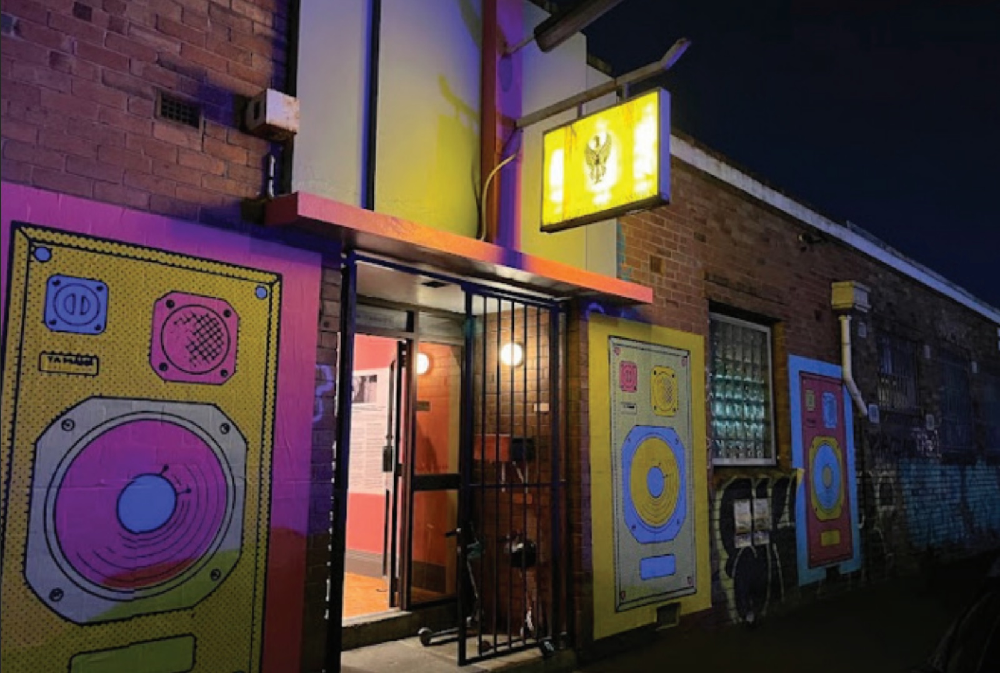
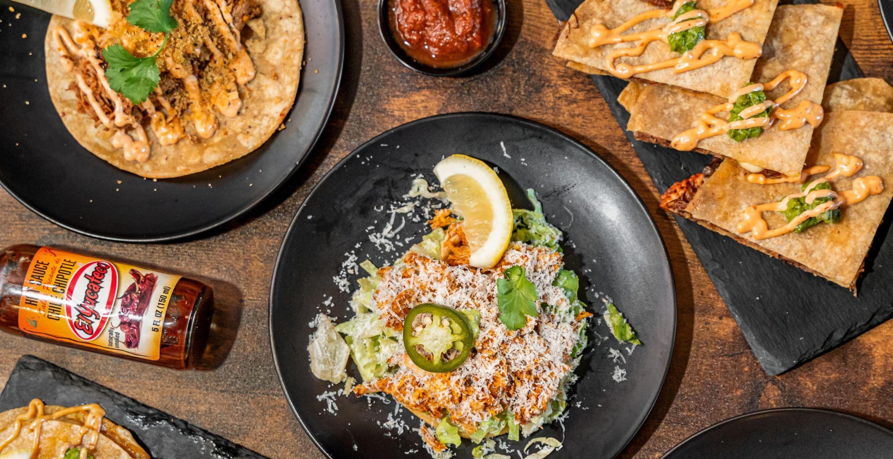
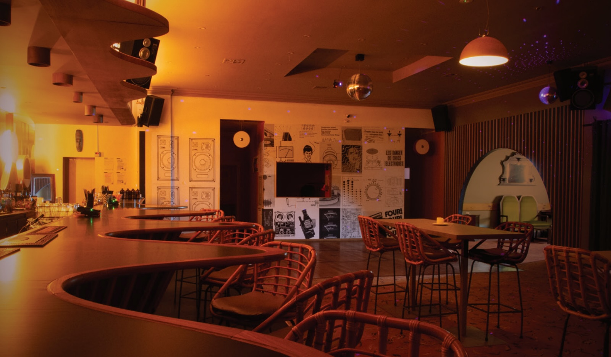

# Sawks is 50

## TL:DR
- **6pm-midnight, 22 August 2026** @ The Quadraphonic Club, 345 Victoria St, Brunswick
- Drinks, food, entertainment provided
- Casual dress
- You don't need to get him anything
- RSVP by 1 August to [50@sawks.com](mailto:50@sawks.com)

## Vibe
- Food, drinks, music, dancing
- About 50 of our favourite people, including some special guests from Aotearoa
- No family stuff, no ceremonies, no speeches
- You don't need to bring anything
- Dress 2 sweat

## Venue

- We're at the [Quadrophonic Club](https://www.quadclub.com.au/), 345 Victoria St, Brunswick, in the "Club Room"
- Entry is via Percy St
- If you're driving, there are parking spots along Victoria St, a small public lot at Victoria St x Tripovich St and paid parking at the Woolworths on Albert St
- It will mainly be a standing affair with some high top/bar seating and a lounge area
- Dark, loud and neuro-friendly
- It's an 18+ licensed venue
- Smoking area outdoors so bring a jacket if you're so inclined

## Food

- Peter from [Latin Quarters Taqueria](https://latinquarterstaqueria.com/) will be serving up tostadas, tacos and dessert, street food style
- Everything is gluten free, with vego options
- If you're not good at garlic and onions it will be tough, we're really sorry. We can get you a pizza delivered?
- If you have a dietary requirement that we might not know about yet, please let us know when you RSVP

## Entertainment

- Open Bar until 11pm
- Expect a tightly curated playlist
- DJ: Sawks (chunkers set) to end the night
- If you wanna get involved let us know

## RSVP
- **6pm-midnight, 22 August 2026** @ The Quadraphonic Club, 345 Victoria St, Brunswick
- If you wanna bring someone along that's cool!
- We'd appreciate it if you could let us know who's coming, and any dietaries or accomodations you might need by 1 August
- If there's anything not covered above just ask
- Email [50@sawks.com](mailto:50@sawks.com) or text us
- We're excited to see you there - Matt & Lisa

## Acknowledgement
- This event takes place on the unceded lands of the Wurundjeri people of the Kulin Nation

